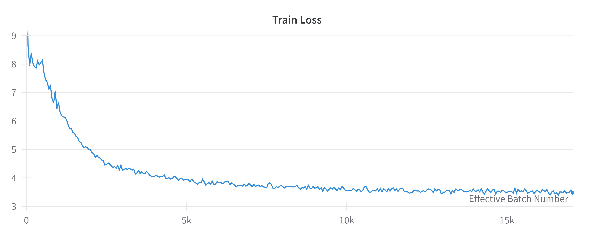

# Distributed Transformer Training 🏗️⚡

DTT is a Python project for transformer-based language model pretraining. It provides a command-line interface for end-to-end workflows and supports multi-node distributed pretraining using PyTorch DDP with Slurm sbatch scripts for easy job scheduling.

<figure>
    
    <figcaption>
        <p align="center">
            <em>Training a 124 million parameter model on 10 billion tokens</em>
        </p>
    </figcaption>
</figure>

0 tokens of training: 
```
Once upon a combinesworthetermined pillowsMelbirdunas EN blended interfaceWorld reign Acc 
```
10 billion tokens of training: 
```
Once upon a time it was a time when those in the North wore a distinctive tunic that we could not understand.
Once upon a time there was a major earthquake, we would expect the current event to have many more consequences.
Once upon a time, some of the great inventions of our times would be found at the Palace of Babylon.
```

## 🚀 Workflow at a Glance
- **Download** a dataset of your choice using `dtt download`.
- **Build and apply** custom tokenizers with `dtt tokenize`.
- **Train** transformer-based language models with `dtt train`.
- **Configurable** architecture and training hyperparameters via YAML files.

## 💻 Local Usage
### **Using pip**
1. **Clone** the repo:
```bash
git clone https://github.com/jamie-stephenson/dtt.git
cd dtt
```

2. **Install** the project into your activated Python environment:
```bash
pip install . torch --index-url https://download.pytorch.org/whl/cpu
```
- Omit the index if you have a gpu on your local machine

3. **Download** a dataset:
```bash
dtt download -d DATASET 
```

- `DATASET`: the name of a [Hugging Face](https://huggingface.co/datasets) dataset of your choice. Alternatively you can use a .txt document as your dataset (see [configs](#%EF%B8%8F-config-files) for details).
4. **Tokenize** this dataset:
```bash
dtt tokenize -c CONFIG 
```
- `CONFIG`: path to config file (default is `configs/config.yaml`, see [configs](#%EF%B8%8F-config-files) for details)
5. **Train** a model:
```bash
dtt train -c CONFIG
```
### **Using uv**
1. **Install** [uv](https://docs.astral.sh/uv/) (if not already installed):
```bash
curl -LsSf https://astral.sh/uv/install.sh | sh
```
2. **Clone** the repo:
```bash
git clone https://github.com/jamie-stephenson/dtt.git
cd dtt
```
3. **Download, Tokenize & Train** (no environment setup necessary):
```bash
uv run --extra cpu dtt download -d DATASET 
uv run --extra cpu dtt tokenize -c CONFIG 
uv run --extra cpu dtt train -c CONFIG
```
- If you have a gpu on your local machine, then use the `--extra gpu` option.

## 🌐 Distributed Usage
### Single-Node
You can accelerate tokenization using OpenMPI:
```bash
mpirun -n NUM_PROC dtt tokenize -c CONFIG
```
- `NUM_PROC`: number of processes to distribute tokenization across (e.g. number of available CPU cores).

If you have multiple GPUs, you can distribute model training across them using `torchrun`:
```bash
torchrun --standalone --nproc_per_node NUM_GPUS -m dtt.main train -c CONFIG
```
### Multi-Node Training using Slurm
The sbatch scripts in `dtt/sbatch` can be use for multi-node training on a cluster with [Slurm](https://slurm.schedmd.com/overview.html) configured.
1. **Download** a dataset on all nodes:
```bash
sbatch sbatch/download.sh
```
2. **Tokenize** the dataset, taking advantage of all nodes:
```bash
sbatch sbatch/tokenize.sh
```
3. **Train** a model, taking advantage of all GPUs on all nodes:
```bash
sbatch sbatch/train.sh
```
Make sure you configure the SBATCH directives (e.g. `--gpus-per-task`) in these scripts to be compatible with the resources available.

You can configure your own Slurm cluster using the [Slurmify](https://github.com/jamie-stephenson/slurmify) Debian package. This project includes the `env.sh` script which can be passed as an argument to `slurmify` to configure a suitable training environment on all nodes.


## ⚙️ Config Files

DTT relies on YAML configuration files to manage most hyperparameters and project settings:

- `configs/config.yaml`: The primary config file that specifies global settings such as model architecture (e.g., hidden size, number of layers), training hyperparameters (learning rate, batch size, epochs), logging preferences, etc.
- `configs/project_datasets/*.yaml`: Individual dataset-specific configuration files. This allows you to easily switch between different datasets, either by changing the `dataset` field in `config.yaml` or by using the `--dataset/-d` CLI option. 

**Tip**: Command-line arguments/options take priority over `config.yaml` files. This allows you to keep a default in the config file while experimenting with setup-specific overrides.
